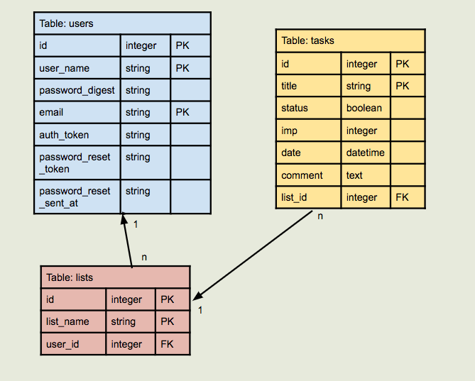

# To Do List App

- [Illustration](#illustration)
- [Features](#feature)
- [Version](#version)
- [Installation](#installation)
- [Future Work](#future)

## Illustration
This app is for the homework of NUSSU COMMIT
Tables included:


## Feature
- This app is a simple to do list without css (yet)
- signup
- login
- reset password (but cannot reseive email)
- can CRUD lists & tasks, CRU user profile
- can rank tasks according to their attributes
- clear directions (link_to) in each page

## Version
* Ruby
ruby 2.3.1p112 (2016-04-26 revision 54768) [x86_64-darwin15]

* Rails
Rails 5.0.0.1

## Installation

To run the app, do:
1. git pull https://github.com/Alina-PANG/To_do_list.git, into Sites/
2. on the command line:
```
        cd Sites/to_do_list
        bin/rails s'cd Sites/to_do_list
        bin/rails db:migrate
```

3. in the browser, go to url: localhost:3000

## future
1. Checkbox --> change status
2. Hide completed tasks
3. Css
